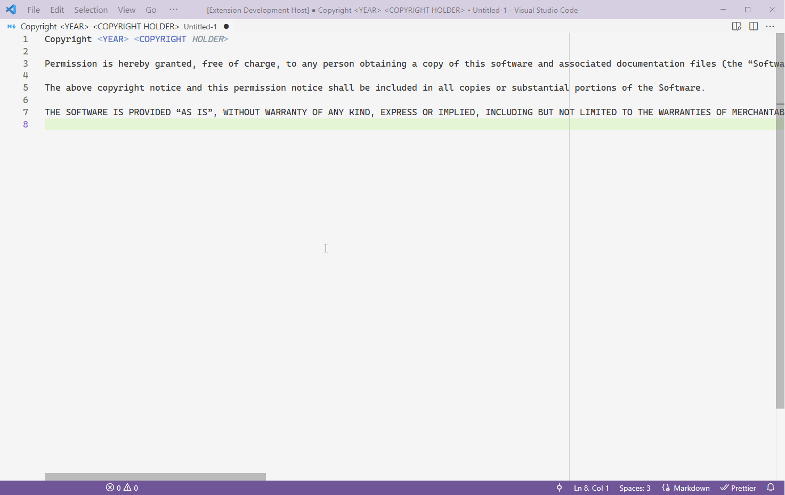

# vscode-wrap-markdown

vscode either doesn't have a button to wrap at your ruler or i couldn't find it. both are equally
likely. in the case of the former, i've made an extension

## features

### wrapping lines (wow really is that so)

you can wrap an entire file or just what you've got selected:



## requirements

a dying need to line-wrap some files

## configuration

it picks where to wrap based on the first ruler in your `editor.rulers` list. if you're unfamiliar,
write something like so:

```json
"editor.rulers": [100]
```

and it'll wrap at column 100

## known issues

treats tabs as 1 column wide. markdown is the one place i use spaces rather than tabs so i probably
won't fix that

## release notes

### 1.1.0

indents stuff that you wanted indented. supports some markdown features now to indent those right
too

### 1.0.0

unleashed upon the world
